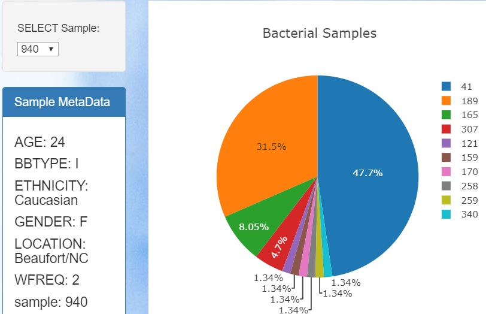
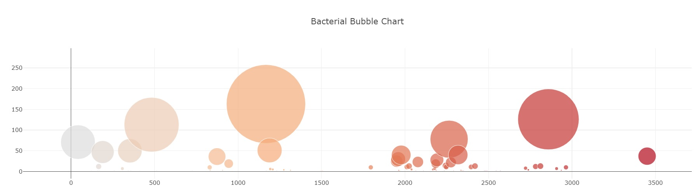

I was tasked with creating an   interactive dashboard to exploring belly button Biodiversity : http://robdunnlab.com/projects/belly-button-biodiversity/   data set. 
Data set was stored in db folder bellybutton.sqlite 
Python flask app.py: using SQAlchemy flask 

### The python flask app has three routes: first route 
@app.route("/")
	def index():
	    """Return the homepage."""
	    return render_template("index.html")
### Is just rendering the index.html

### The Second  route 

@app.route("/names")
	def names():
	    """Return a list of sample names."""
	

	    # Use Pandas to perform the sql query
	    stmt = db.session.query(Samples).statement
	    df = pd.read_sql_query(stmt, db.session.bind)
	

	    # Return a list of the column names (sample names)
	    return jsonify(list(df.columns)[2:])
	

### useing pandas to query the data base and display a list of names

### next route : 
@app.route("/metadata/<sample>")
	def sample_metadata(sample):
	    """Return the MetaData for a given sample."""
	    sel = [
	        Samples_Metadata.sample,
	        Samples_Metadata.ETHNICITY,
	        Samples_Metadata.GENDER,
	        Samples_Metadata.AGE,
	        Samples_Metadata.LOCATION,
	        Samples_Metadata.BBTYPE,
	        Samples_Metadata.WFREQ,
	    ]
	

	    results = db.session.query(*sel).filter(Samples_Metadata.sample == sample).all()
### Then with in that query : 
sample_metadata = {}
	    for result in results:
	        sample_metadata["sample"] = result[0]
	        sample_metadata["ETHNICITY"] = result[1]
	        sample_metadata["GENDER"] = result[2]
	        sample_metadata["AGE"] = result[3]
	        sample_metadata["LOCATION"] = result[4]
	        sample_metadata["BBTYPE"] = result[5]
	        sample_metadata["WFREQ"] = result[6]
	

	    print(sample_metadata)
	    return jsonify(sample_metadata)

 
 ### And last routre : 
@app.route("/samples/<sample>")
	def samples(sample):
	    """Return `otu_ids`, `otu_labels`,and `sample_values`."""
	    stmt = db.session.query(Samples).statement
	    df = pd.read_sql_query(stmt, db.session.bind)
	

	    # Filter the data based on the sample number and
	    # only keep rows with values above 1
	    sample_data = df.loc[df[sample] > 1, ["otu_id", "otu_label", sample]]
	    # Format the data to send as json
	    data = {
	        "otu_ids": sample_data.otu_id.values.tolist(),
	        "sample_values": sample_data[sample].values.tolist(),
	        "otu_labels": sample_data.otu_label.tolist(),
	    }
	    return jsonify(data)

I then created used JavaScript located in file folder static / js/ app.js 

I used Plotly.js  in file js/app.js 

Located in static/js/ app.js I used a file to create two plots taking the metadata routre of info being displayed I used plotly.js to create an interactive Pie chart were you can change the data sample  being used for the chart 

# then useing the same sample data set up in the pie chart I created a bubble chart at the bottom of the screen

